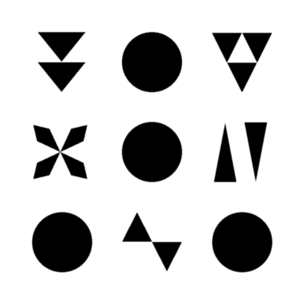

  
  <h1>Acute32</h1>

  

    <strong>The Symbolic Barcode made with triangles</strong>
  

  <h3>
    <a href="https://www.visioniechor.org/symcode-docs">Story</a>
     | 
    <a href="https://symcode.visioniechor.org/">Demo</a>
     | 
    <a href="https://github.com/visioniechor/symcode">Library</a>
  </h3>
  Built with 🦀 by <a href="//www.visioniechor.org/">The Vision iEchor Research Group</a>

## Sample SymCode

## Alphabet
